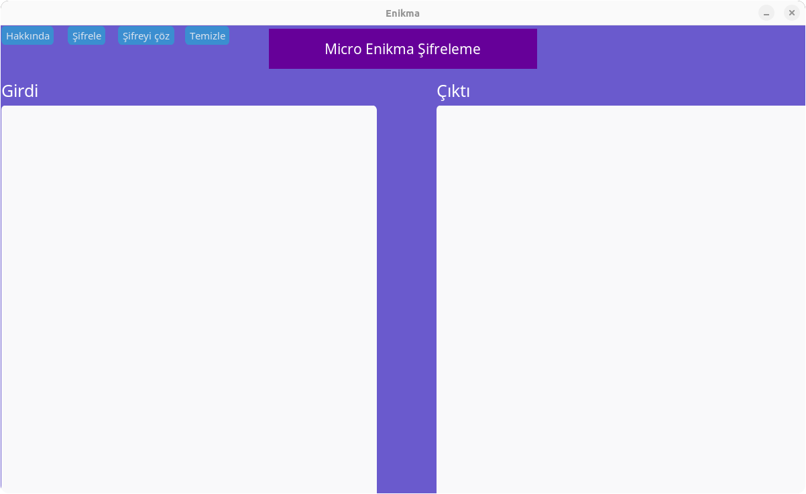

# Enikma
Enikma bir şifreleme programıdır.Girdiğiniz metni şifreler veya şifrelenmiş bir metni tekrar çözer. Bu programda şifrelenen bir metin sadece bu programda çözülür, bu şifreleme metodunu gizli tutabilmek için bu programın kaynak kodları gizlidir. Bu program sadece GNU Linux işletim sistemlerinde çalışır.
## Install and Upgrade
For Debian and debian-based distributions

  <button style="position:absolute; top:5px; right:5px; background-color:#fff; border:none; color:#000; padding:5px 10px; border-radius:3px;" onclick="navigator.clipboard.writeText('curl -sSL https://micro-pack.netlify.app/enikma/install.sh | bash')"></button>
  <pre><code>curl -sSL https://micro-pack.netlify.app/enikma/install.sh | bash</code></pre>

